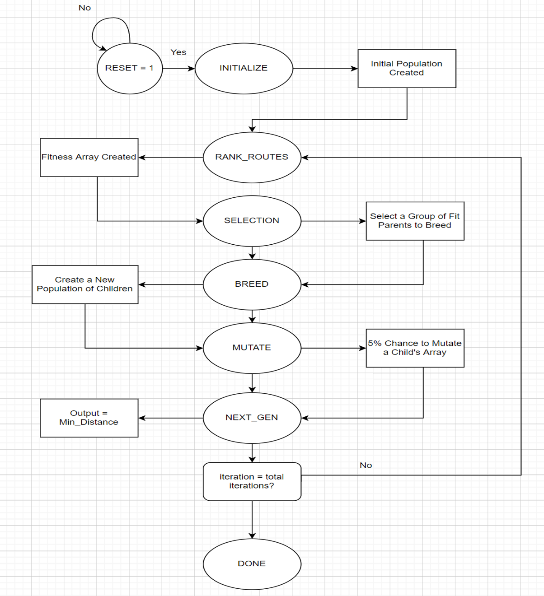

# CSUN ECE Fall 2021
## Final Project - Genetic Algorithm Design using HDL

**Report Created by:**
-  Ian O'Donnell

**Submission date:** 12/08/21

## Introduction

Genetic algorithm (GA) is a search heuristic, inspired by the theory of natural evolution. It reflects the process of natural selection where "Fit" individuals survive for reproduction while the "Weak" once's die out where individuals are possible solutions. GA is commonly used to create high-quality solutions to optimization and search problems using the following operators:

these biologically inspired operators are the following:
- Initial Population
- Fitness Function
- Selection
- Crossover
- Mutation

- Initial Population: Is the initial input data to the algorithm, usually created randomly.

- Fitness Function: Is a function that will give each data it's own fitness rating that will be used in the selection process

- Selection: There are many different ways to select a data set. Some examples are:
Roulette Wheel, Rank Selection, Steady State, Tournament, and Elitism. The difference between these methods are how fast they will converge to an answer. Different problems set may benefit with different selection processes. 

- Crossover: Is used to switch the contents of two possible solutions "genes". This will introduce more possible outputs that may be more fit then the current genes in the current population "chromsome". 

- Mutation: This process is used to mutate a single gene to help prevent the algorithm from converging on a local minimum and ideally find the global minimum "most optimal" solution.

## Procedure
TBD (Tasks done to meet project requirements)
The first step in this project was to create an inital population. This was done by creating a text file of coordinates. Next, I read the input coordinates. Each X coordinate index was tracked and placed in an array: example (0,2,4,6 . . .), where each value represents the position of the x coordinate. The order of the x coordinates were shuffled to create the population.

The second step in the project is to create a fitness function. This was done by using the Distance task, which will read in the input X1, X2, Y1, and Y2 coordinates and outputting the distance between cities. Each distance between cities were added up until the final route was calculated (including final city back to starting city).

The third step was to select routes for the breeding process. The selection process was done by the using tournament selection, the "winner" of the range of routes was selected for breeding only. 

Breeding was done by obtaining a random value to determine the cut point of two selected fit parents. The order of cities were then merged together into one child. This was done by taking parent 1's city order up to the cut point and placing it into the child array. Then all of the missing cities, in the order that they appeared in parent 2, was placed in the child array. 

Mutation occured by using a sudo random generator to mutate 5% of the child population. Mutation was done by swapping two random city locations.

Finally, the child population was used as the new population. 

## Testing Strategy
Each individual state was tested using the waveforms and by using text print outs. THese can be seen in the RESULTS below.

## Results (Data)
TBD (Result, HW control or data produced after completion of the project)

### LFSR (Linear Feedback Shift Register)

### Initial Population

### Distance / Fitness (Rank Route)

### Selection

### Cross Breeding

### Mutation

### Generations

## FPGA Resources
The FPGA resources could not be determined because I used a shuffle() method. I will have to remove this shuffle() function in the future so that this code can be fully synthsizable. 

## Conclusion
There were a few aspects of the Genetic Algorithm that I need to change to optimize it. I created the code to behave too much like natural selection, but natural selection can be optimized. A few changes I should have done are the following:

- Not force all of my "fit" parents to reproduce. Instead use elitism to let me fit parents go to the next population without breeding. 

- Not mutate the children of my population, instead mutate random parents and pass the mutated parents directly to the next population.

- reproduce random parents using a roulette selection method, not just fit parents. 
